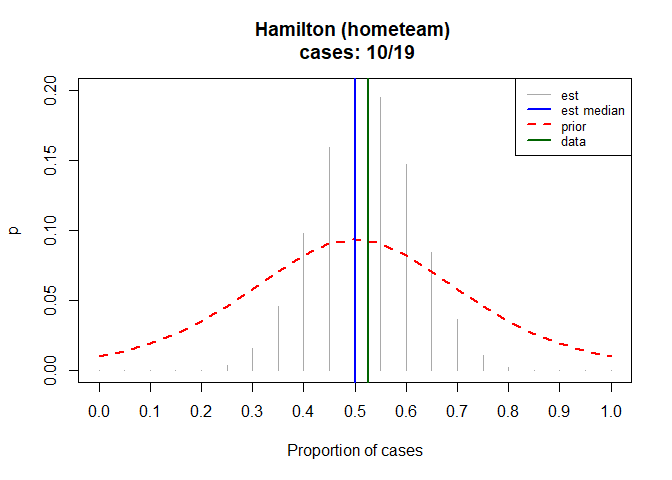

<!-- README.md is generated from README.Rmd. Please edit that file -->
scoccer
=======

Easen the usage of scottish soccer data from data from <http://www.football-data.co.uk>. Notes of columns can be found at: <http://www.football-data.co.uk/notes.txt>

Installation
------------

You can install scoccer from github with:

``` r
# install.packages("devtools")
devtools::install_github("steffenbank/scoccer")
```

Acquire data
------------

The most basic function within the packages are *sco\_acquire*. Currently are two leagues available:

1.  Scottish Premiership ("sco\_pl")
2.  Scottish Champtionship ("sco\_ch")

Years from 2001 till now are available - season inputs may be specificed as "yyyy", for instance 2018/2019 season "1819".

Data from Scottish Premiership 2017/2018:

``` r
library(scoccer)
dplyr::glimpse(sco_acquire("1718", "sco_pl"))
#> Observations: 228
#> Variables: 23
#> $ div      <fct> SC0, SC0, SC0, SC0, SC0, SC0, SC0, SC0, SC0, SC0, SC0...
#> $ date     <date> 2017-08-05, 2017-08-05, 2017-08-05, 2017-08-05, 2017...
#> $ hometeam <fct> Celtic, Dundee, Hibernian, Kilmarnock, Aberdeen, Moth...
#> $ awayteam <fct> Hearts, Ross County, Partick, St Johnstone, Hamilton,...
#> $ fthg     <int> 4, 1, 3, 1, 2, 1, 0, 3, 0, 2, 1, 4, 2, 1, 0, 2, 0, 1,...
#> $ ftag     <int> 1, 2, 1, 2, 0, 2, 1, 0, 1, 3, 2, 1, 1, 3, 2, 0, 0, 0,...
#> $ ftr      <fct> H, A, H, A, H, A, A, H, A, A, A, H, H, A, A, H, D, H,...
#> $ hthg     <int> 1, 0, 2, 0, 1, 1, 0, 2, 0, 1, 1, 2, 1, 0, 0, 0, 0, 1,...
#> $ htag     <int> 0, 1, 1, 1, 0, 1, 1, 0, 1, 2, 1, 1, 0, 0, 1, 0, 0, 0,...
#> $ htr      <fct> H, A, H, A, H, D, A, H, A, A, D, H, H, D, A, D, D, H,...
#> $ referee  <fct> K Clancy, W Collum, N Walsh, S McLean, E Anderson, B ...
#> $ hs       <int> 17, 13, 12, 12, 17, 10, 3, 13, 8, 12, 5, 9, 10, 15, 3...
#> $ as       <int> 4, 14, 6, 8, 5, 15, 17, 11, 9, 13, 13, 11, 9, 18, 15,...
#> $ hst      <int> 7, 6, 6, 4, 7, 2, 1, 7, 3, 2, 3, 7, 6, 9, 0, 3, 2, 3,...
#> $ ast      <int> 3, 5, 3, 2, 3, 3, 6, 4, 4, 4, 7, 3, 1, 8, 6, 3, 0, 3,...
#> $ hf       <int> 9, 14, 13, 12, 10, 17, 9, 13, 23, 15, 21, 9, 11, 11, ...
#> $ af       <int> 21, 8, 19, 16, 17, 17, 6, 19, 17, 14, 14, 13, 15, 12,...
#> $ hc       <int> 9, 15, 3, 1, 3, 7, 3, 5, 4, 6, 2, 7, 4, 9, 5, 1, 13, ...
#> $ ac       <int> 5, 5, 4, 10, 2, 5, 11, 7, 5, 5, 6, 6, 6, 7, 5, 3, 2, ...
#> $ hy       <int> 1, 1, 2, 1, 1, 4, 1, 1, 3, 6, 3, 1, 3, 0, 2, 2, 2, 0,...
#> $ ay       <int> 3, 2, 3, 4, 3, 2, 1, 3, 2, 3, 1, 0, 1, 2, 0, 2, 1, 2,...
#> $ hr       <int> 0, 0, 0, 0, 0, 0, 0, 0, 1, 1, 0, 0, 0, 0, 0, 0, 0, 0,...
#> $ ar       <int> 0, 0, 0, 0, 1, 0, 0, 0, 1, 0, 0, 3, 0, 0, 0, 1, 0, 0,...
```

Standings
---------

*sco\_standings* may be used to compute standing at one of the league at a specific time.

What was the championship standing at 1st of March 2016?

``` r
sco_standings("1516","sco_ch","2016-03-01")
#> Joining, by = "team"
#> # A tibble: 10 x 10
#>    standing at_time    team  games_played games_won games_loss score
#>       <int> <date>     <fct>        <int>     <dbl>      <dbl> <chr>
#>  1        1 2016-03-01 Rang~           26        21          2 68:17
#>  2        2 2016-03-01 Hibe~           26        17          5 43:23
#>  3        3 2016-03-01 Falk~           26        15          3 44:21
#>  4        4 2016-03-01 Rait~           24        10          9 29:30
#>  5        5 2016-03-01 Mort~           26         8         11 28:30
#>  6        6 2016-03-01 Quee~           24         9         11 23:32
#>  7        7 2016-03-01 St M~           25         7         12 24:34
#>  8        8 2016-03-01 Dumb~           25         7         14 22:44
#>  9        9 2016-03-01 Livi~           26         5         16 27:39
#> 10       10 2016-03-01 Alloa           26         3         19 14:52
#> # ... with 3 more variables: goal_diff <int>, points <dbl>,
#> #   additional_data <list>
```

Prediction the probability of both teams scoring
------------------------------------------------

A relevant measure is whether a team will score. The package supports a bayesian-model approach. The prior is a logistic function with location of 0.5, corresponding to on average boths teams will score in every second game. This prior is computed using data from <https://www.thestatsdontlie.com/football/stat-leaders/>. Data input of the bayesian-model is acquired from the seasons data as year "yyyy".

What is the probability that both teams will score if Hamilton Academical F.C. plays at home? The figure shows the result of the bayesian apporach; grey lines beging probability of proportion of cases (case = both teams score), blue line being estimated median, the green line being the data and the red line beting the prior distribution. The bayesian-modeling returns no firm value but rather a distribution.

``` r
sco_bayesian_btts("1819","sco_pl","hometeam","Hamilton")
```



Alternatively, how often do both teams scores when Celtic is the home team? Rather rare, Celtic has been extremely dominant and combining the prior and the data one get a good estimate of the probability.

``` r
sco_bayesian_btts("1819","sco_pl","hometeam","Celtic")
```


Card plots
----------

Another relevant measure of games is cards. The package supports two card plots (one for referees and one for teams):

``` r
sco_team_card_plot("1819","sco_pl")
#> Joining, by = "team"
#> Joining, by = "team"
```


``` r
sco_ref_card_plot("1819","sco_ch")
#> Joining, by = "referee"
```


Misc stats development
----------------------

Data from *sco\_acquire* consists of some additional parameters (goals,shots, cards, corners) during a season. The input of the function is the home and away stat of a team during a season. Note, not all stats are available for all seasons of the Championship. For instance, what is the devlopment of yellow cards during a season?

``` r
sco_misc_stats_develop("yellowcards","1819","sco_pl")
#> `geom_smooth()` using method = 'loess' and formula 'y ~ x'
```


Prediciting scores of games
---------------------------

The main modeling framework of *scoccer* is the expected goals predicter. It uses the basisc *sco\_acquire* functionality to predict the most likely score between two teams. Between two teams a realtive strength of *n* previous games of *sco\_relative\_strength* is calculate:

``` r
sco_relative_strength("1819","sco_ch","Ayr","Partick",5) 
#> Joining, by = "hometeam"
#> Joining, by = "awayteam"
```

The strength is a measure of how well the team does at attacking/defending compared to other teams. Values above one corresponds to relatively better and values below relatively lower. This data is used as an input to *sco\_poisson\_xg*-function, which calculates the most likely score looking *n* games back between two teams. To find the optimal *n* the *sco\_poisson\_xg\_calibration*-function may be used.

To illustrate the workflow of predictions lets assume we know the optimal games (in order to hit the exact result) is between four or five games back in the premier league:

``` r
suppressMessages(sco_poisson_xg_calibration("1819","sco_pl",4,5))
```


We get slightly better predictions by choosing *4*. Nowe we can create some arbitrary matchups, loop through the expected goals between those and plot it:

``` r
a <- c('Dundee','Hamilton','Motherwell','Celtic','Hibernian','Kilmarnock')
b <- c('St Mirren','St Johnstone','Livingston','Hearts','Aberdeen','Rangers') 

for(i in 1:length(a)) {
  
  # for one
  if(i == 1) {base_plot_data <- suppressMessages(sco_poisson_xg_predictions(sco_relative_strength("1819","sco_pl",a[i],b[i],4)))} else {
  
  # for two or more
  dplyr::bind_rows(
    suppressMessages(sco_poisson_xg_predictions(sco_relative_strength("1819","sco_pl",a[i],b[i],4))),
    base_plot_data) -> base_plot_data
  }
}

ggplot2::ggplot(base_plot_data,ggplot2::aes(x = goals, y = pct, color = position, group = position)) + 
  ggplot2::geom_line() + 
  ggplot2::geom_point() + 
  ggplot2::theme_minimal() +
  ggplot2::scale_y_continuous(labels = scales::percent) + 
  ggplot2::theme(legend.title = ggplot2::element_blank()) +
  ggplot2::labs(x = "", y = "") +
  ggplot2::scale_color_brewer(palette = "Set1") +
  ggplot2::facet_wrap(~matchup) +
  ggplot2::labs(title = "Predictions")
```


